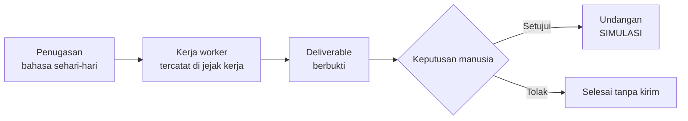
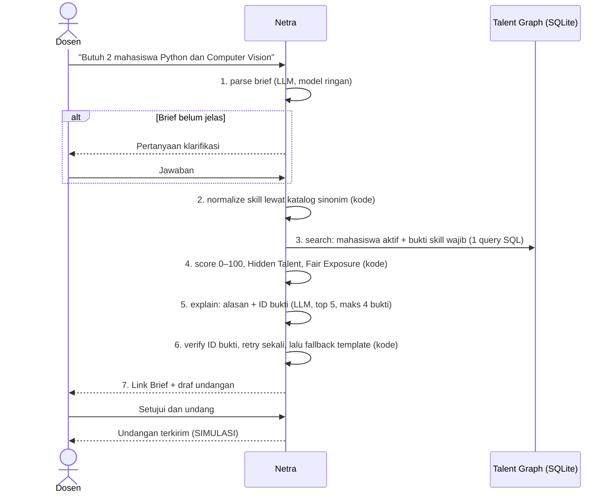
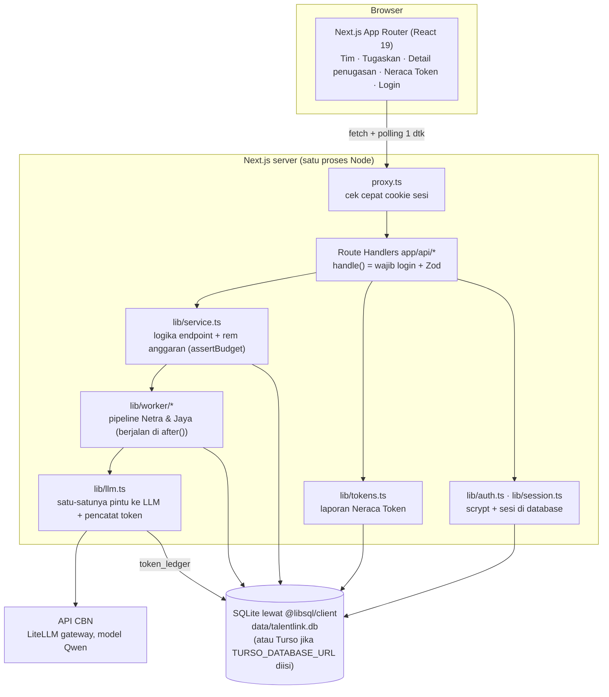

# TalentLink Campus

**An AI Digital Worker That Links Students to Research and Competitions, Backed by Evidence.**
*Every recommendation, linked to evidence.*

TalentLink Campus adalah tim **Digital Worker** AI untuk kampus. Digital Worker ini mencari, menilai, dan merekomendasikan mahasiswa untuk riset dosen dan tim lomba. Setiap rekomendasi menunjuk ke bukti yang bisa dibuka, dan setiap tindakan menunggu persetujuan manusia.

| Item | Isi |
| --- | --- |
| Event | PENS Hackathon 2026, track **CBN Digital Campus Worker**, 9–10 Oktober 2026, Surabaya |
| Digital Worker | **Netra**, Research Talent Officer (LPPM) · **Jaya**, Competition Team Officer (Bagian Kemahasiswaan) |
| Mesin AI | API CBN (gateway LiteLLM kompatibel OpenAI, model Qwen), alokasi 10.000.000 token |
| Bentuk rilis | Prototipe web di localhost dengan **data sintetis** |

> **Transparansi.** Semua data mahasiswa di aplikasi ini **sintetis** (berlabel *Sintetis* di UI). Pengiriman undangan **disimulasikan** (berlabel *SIMULASI*), tidak ada email atau WhatsApp sungguhan.

---

## Daftar isi

1. [Target user](#1-target-user)
2. [Problem](#2-problem)
3. [Workflow](#3-workflow)
4. [Data source](#4-data-source)
5. [Architecture](#5-architecture)
6. [Setup instruction](#6-setup-instruction)
7. [Test case and results](#7-test-case-and-results)
8. [Token usage](#8-token-usage)
9. [Limitation](#9-limitation)
10. [Team responsibilities](#10-team-responsibilities)

---

## 1. Target user

| Persona | Peran | Kebutuhan | Yang didapat dari TalentLink Campus |
| --- | --- | --- | --- |
| **Dosen peneliti** (user utama, contoh fiktif: Bu Rina) | Memberi tugas ke Netra, menyetujui undangan riset | 2 mahasiswa untuk riset semester ini | Shortlist berbukti dalam kurang dari satu menit, termasuk mahasiswa dari kelas lain |
| **Staf kemahasiswaan / dosen pembina lomba** (contoh fiktif: Pak Andi) | Memberi tugas ke Jaya, menyetujui undangan seleksi | Tim 3 orang untuk lomba nasional | Tim yang lolos syarat, peran saling melengkapi, tanda Fair Exposure dan cek konflik |
| **Kepala unit** (Kepala LPPM, Kepala Bagian Kemahasiswaan) | Atasan Digital Worker | Tahu batas kerja dan biaya worker | Kartu pegawai worker (jabatan, akses, level) dan halaman **Neraca Token** |
| **Mahasiswa** | Penerima undangan (tidak memakai sistem di prototipe) | Kesempatan riset dan lomba | Diundang karena bukti kemampuan, bukan popularitas |

---

## 2. Problem

Kampus sudah memiliki data kemampuan mahasiswa (nilai, proyek, sertifikat, prestasi, pengalaman asisten), tetapi datanya **tersebar** dan tidak dipakai untuk mengambil keputusan.

| Masalah | Akibat |
| --- | --- |
| Dosen mencari anggota riset dari ingatan dan kenalan | Kandidat terbatas pada mahasiswa yang pernah diajar atau sudah terkenal |
| Staf kemahasiswaan menyaring syarat lomba secara manual | Syarat formal terlewat; peluang berputar di mahasiswa yang sama |
| Prestasi formal dianggap satu-satunya bukti | Mahasiswa berpotensi yang belum pernah juara (**hidden talent**) tidak terlihat |
| Chatbot AI umum bisa mengarang | Rekomendasi tanpa sumber tidak bisa dipercaya untuk keputusan akademik |

**Alternatif yang ada:** sistem informasi prestasi mencatat prestasi yang sudah terjadi, tetapi tidak mencari kandidat untuk kebutuhan baru dan tidak menjelaskan alasannya dengan bukti.

**Solusi:** Digital Worker dengan jabatan, penempatan, atasan, tingkat kemampuan, knowledge base, dan hak akses (konsep CBN Digital Worker). AI hanya dipakai untuk **memahami permintaan** dan **menulis alasan**. Skor, filter, eligibility, dan peringkat dihitung di kode, lalu setiap ID bukti yang dikutip AI diverifikasi.

---

## 3. Workflow

### 3.1 Pola kerja semua Digital Worker



### 3.2 Research Matching oleh Netra (alur utama)



| # | Langkah | Dikerjakan oleh | Keterangan |
| --- | --- | --- | --- |
| 1 | `parse` | LLM (`CBN_MODEL_PARSE`) | Brief → kriteria JSON (topik, skill wajib/tambahan, semester minimum, jumlah). Brief ambigu → status `needs_clarification` |
| 2 | `normalize` | Kode | Nama skill → ID katalog lewat alias (mis. "CV", "Pengolahan Citra" → Computer Vision). Skill wajib di luar katalog → penugasan dihentikan |
| 3 | `search` | Kode (SQL) | Status aktif, semester ≥ minimum, punya bukti untuk skill wajib |
| 4 | `score` | Kode | Rumus di bawah; dilewati di Jalur Pembanding (v1) |
| 5 | `explain` | LLM (`CBN_MODEL_EXPLAIN`) | 2–3 alasan per kandidat, masing-masing wajib mengutip ID bukti; data dibungkus `<data>` agar instruksi di dalamnya diabaikan |
| 6 | `verify` | Kode | Buang alasan dengan ID bukti di luar paket kandidat → retry explain sekali → alasan template dari judul bukti |
| 7 | `brief` | Kode | Simpan Link Brief; status `awaiting_approval` |

**Rumus skor** (untuk setiap skill *s*, ambil bukti terbaik kandidat):

```
best(s) = max over evidence e:  strength(e,s)/3 × w_type(e) × w_recency(e)
score   = 100 × (0,75 × rata-rata best(skill wajib) + 0,25 × rata-rata best(skill tambahan))
```

- `w_type`: project 1,0 · research 1,0 · award 0,9 · assistant 0,8 · course (A 1,0 / B 0,7 / C 0,4) · certificate 0,5
- `w_recency`: tahun acuan 2026 = 1,0 · 2025 = 0,85 · lebih lama = 0,7
- **Hidden Talent:** skor ≥ 70 dan tidak punya bukti bertipe award.
- **Fair Exposure:** komitmen aktif ≥ 2 → diberi tanda "sudah banyak dilibatkan", tetap ditampilkan.
- **Tanpa kandidat ≥ 50:** tampil 3 kandidat terdekat beserta skill yang kurang.
- Nama, gender, dan foto **tidak** dipakai menghitung skor dan tidak dikirim ke AI (hanya kode mahasiswa).

### 3.3 Competition Matching oleh Jaya

Staf menempelkan teks guidebook lomba → Jaya mengekstrak syarat (LLM) → **Eligibility Check** dengan alasan tertulis untuk setiap mahasiswa yang tersaring → **Team Builder** (peran langka diisi lebih dulu, tanpa mahasiswa dobel) → alasan berbukti (LLM) → **Conflict Check** (dobel tim, mahasiswa yang baru disetujui untuk riset Netra, Fair Exposure) → usulan tim → persetujuan staf. Jaya memakai tujuh nama langkah dan Approval Gate yang sama dengan Netra, dan selalu memakai Jalur Hemat.

### 3.4 Alur demo di UI (6 klik)

1. Masuk dengan akun demo → **Tim** (kartu pegawai Netra dan Jaya).
2. **Tugaskan** → tulis kebutuhan riset atau klik contoh brief → pilih **Jalur Hemat** → Tugaskan.
3. **Detail penugasan**: jejak kerja bergerak (polling 1 detik) → Link Brief muncul.
4. Klik chip ID bukti → panel bukti terbuka (jenis, judul, detail, tahun, label Sintetis).
5. **Setujui dan undang** → status "Undangan terkirim (SIMULASI)", tercatat atas nama pengguna yang login.
6. Refresh halaman → jejak kerja, Link Brief, dan token tetap ada.

Halaman **Neraca Token** (`/tokens`) menampilkan token terpakai, sisa anggaran, status Aman/Menipis/Berhenti, penghematan Jalur Hemat dibanding Jalur Pembanding, dan rincian token per penugasan, per worker, dan per langkah.

---

## 4. Data source

| Sumber | Isi | Keterangan |
| --- | --- | --- |
| **Talent Graph sintetis** (`lib/seed.ts`, `npm run seed`) | 89 mahasiswa (80 acak + 9 profil tanam), 20 skill dengan sinonim, 478 bukti, 660 relasi bukti–skill | Deterministik (PRNG ber-seed tetap `20261009`), semua berlabel `source_label = "Sintetis"` |
| Prodi | Teknik Informatika, Sains Data Terapan, Teknik Komputer, Teknologi Game | Semester 2–8; 5 mahasiswa acak berstatus cuti |
| Jenis bukti | `course` (dengan nilai A/B/C), `project`, `certificate`, `award`, `assistant`, `research` | 3–8 bukti per mahasiswa; setiap bukti punya ID `EV-xxx` yang bisa dirujuk |
| **Profil tanam untuk uji** | S-101–S-103 ideal Computer Vision · S-104 Hidden Talent (tanpa award) · S-105 hanya sertifikat · S-106 IoT/ESP32 · S-107 berisi teks *prompt injection* · S-108 cuti · S-109 Fair Exposure (3 komitmen aktif) | Dipakai kriteria penerimaan AC-01 sampai AC-06 |
| **Guidebook lomba contoh** (`lib/worker/competition/guidebooks.ts`) | `ai-nasional` (Lomba Inovasi AI Nasional 2026) dan `iot-smart-campus` | Sintetis |
| **Akun demo** (`lib/auth.ts`) | `rina@kampus.test` (Bu Rina, dosen peneliti) · `andi@kampus.test` (Pak Andi, staf kemahasiswaan) · kata sandi `talentlink2026` | Dibuat otomatis saat login pertama; domain `.test` khusus pengujian |
| **API CBN** | LLM untuk parse dan explain | Base URL, key, dan nama model dari `.env` |

Tidak ada data kampus asli atau rahasia yang dipakai. "Belum ada bukti di data kampus" berarti data belum mencatatnya, bukan berarti mahasiswa tidak menguasainya.

---

## 5. Architecture



| Lapisan | Pilihan | Lokasi |
| --- | --- | --- |
| Frontend | Next.js 16 App Router, React 19, Tailwind CSS 4, ikon Lucide, font Outfit + JetBrains Mono | `app/`, `components/`, `app/_lib/` |
| API | Next.js Route Handlers, validasi Zod 4 | `app/api/`, `lib/http.ts`, `lib/service.ts` |
| Pipeline AI | Orkestrator per worker; LLM hanya untuk parse dan explain | `lib/worker/`, `lib/worker/competition/` |
| Klien LLM | `fetch` ke `/chat/completions` (kompatibel OpenAI), `temperature: 0`, `response_format: json_object`, thinking Qwen dimatikan, timeout 30 detik, retry sekali untuk timeout/jaringan | `lib/llm.ts` |
| Database | SQLite lewat `@libsql/client`; tabel dibuat otomatis saat pertama dibuka; skema Drizzle untuk dokumentasi dan `drizzle-kit studio` | `lib/db.ts`, `lib/schema.ts` |
| Autentikasi | Email + kata sandi, hash `scrypt` bawaan Node, token sesi 32 byte (disimpan SHA-256), cookie `tl_session` httpOnly 8 jam | `lib/auth.ts`, `lib/session.ts`, `proxy.ts` |
| Test | Vitest dengan `LLM_MOCK=true` dan database sementara | `lib/**/*.test.ts` |

**Tabel database:** `students`, `skills`, `evidence`, `evidence_skills` (Talent Graph, hanya dibaca worker) · `runs`, `run_steps`, `token_ledger`, `approvals` (jejak kerja dan audit) · `users`, `sessions` (login).

**Status penugasan:** `queued` → `running` → `needs_clarification` / `awaiting_approval` → `approved` / `rejected` / `failed`.

**Endpoint utama** (semua wajib login kecuali login/logout):

| Method | Path | Fungsi |
| --- | --- | --- |
| POST | `/api/auth/login`, `/api/auth/logout` · GET `/api/auth/me` | Login, logout, pengguna aktif |
| GET | `/api/worker` | Kartu Digital Worker + pemakaian token |
| POST / GET | `/api/runs` | Buat penugasan `{workerId, brief, mode}` (pipeline di background) / daftar 20 terbaru |
| GET | `/api/runs/:id` | Status, jejak kerja, token per langkah, Link Brief |
| POST | `/api/runs/:id/clarify` · `/approve` · `/send` · `/retry` | Jawab klarifikasi · setujui/tolak · kirim SIMULASI (403 tanpa persetujuan) · coba lagi |
| GET | `/api/evidence/:id` | Detail satu bukti untuk panel bukti |
| GET | `/api/tokens` | Laporan Neraca Token |

**Prinsip keamanan dan tata kelola:** worker read-only terhadap data mahasiswa (tidak ada endpoint yang mengubah `students`/`evidence`) · tidak ada pesan terkirim tanpa persetujuan · setiap penugasan, langkah, panggilan LLM, dan keputusan tercatat dengan waktu · API key hanya di `.env`.

---

## 6. Setup instruction

### Prasyarat

- **Node.js ≥ 22.9** (skrip memakai `node --env-file-if-exists`; diuji di Node 22 dan 24).
- npm.
- Akses ke API CBN (base URL dan key dari panitia), **atau** pakai mode mock tanpa token.

### Langkah

```bash
git clone <url-repo> TalentLink-Campus
cd TalentLink-Campus
git config core.hooksPath .githooks   # hanya untuk kontributor: hook pembersih atribusi AI

npm install
```

> **Catatan instalasi (Windows/Node 24).** `package.json` masih mencantumkan `better-sqlite3`, modul native yang **tidak lagi diimpor** kode sejak database pindah ke `@libsql/client`. Di mesin tanpa Python dan C++ build tools, `npm install` bisa gagal saat membangun modul itu. Jika terjadi, jalankan `npm install --ignore-scripts`; aplikasi, seed, CLI, dan test tetap berjalan karena modul tersebut tidak dipakai.

Siapkan environment (salin template, lalu isi `CBN_API_KEY`):

```bash
cp .env.example .env
```

| Variabel | Bawaan | Fungsi |
| --- | --- | --- |
| `CBN_API_BASE_URL` | `https://litellm-hackathon.digdaya.ai/v1` | Gateway API CBN |
| `CBN_API_KEY` | (kosong) | Key dari panitia; **jangan di-commit** |
| `CBN_MODEL_PARSE` / `CBN_MODEL_EXPLAIN` | `qwen3.8-flash` / `qwen3.7-plus` | Model ringan untuk parse, model lebih kuat untuk explain |
| `TOKEN_BUDGET_TOTAL` / `_WARN` / `_STOP` | `10000000` / `0.8` / `0.95` | Anggaran token dan batas rem |
| `LLM_MOCK` | `false` | `true` = jawaban contoh tanpa memakai token |
| `DATABASE_PATH` | `data/talentlink.db` | Lokasi file SQLite |
| `TURSO_DATABASE_URL`, `TURSO_AUTH_TOKEN` | (kosong) | Opsional, untuk database Turso saat deploy |

Isi database dan jalankan:

```bash
npm run seed      # data sintetis deterministik; Token Ledger dipertahankan
npm run dev       # http://localhost:3000
```

Buka `http://localhost:3000`, lalu masuk dengan akun demo `rina@kampus.test` / `talentlink2026` (atau klik kartu akun demo di halaman login).

### Mode alternatif

| Kebutuhan | Perintah |
| --- | --- |
| Tanpa memakai token CBN | `LLM_MOCK=true npm run dev` (PowerShell: `$env:LLM_MOCK="true"; npm run dev`) |
| Frontend saja dengan data contoh | `NEXT_PUBLIC_API_MOCK=true` di `.env.local` |
| Pipeline tanpa UI (CLI) | `npm run cli -- "Butuh 2 mahasiswa Python dan Computer Vision untuk riset deteksi objek" --mode v2` |
| CLI Jaya | `npm run cli -- --sample ai-nasional` atau `npm run cli -- --worker jaya --file guidebook.txt` |
| Seed ulang + kosongkan Token Ledger | `npm run seed -- --reset-ledger` |
| Test, lint, build | `npm test` · `npm run lint` · `npm run build` |
| Lihat isi database | `npm run db:studio` |

---

## 7. Test case and results

### 7.1 Ringkasan

Diuji ulang pada **10 Oktober 2026** di repo bersih (commit `c8a3abc`, Windows 10, Node 24.17.0):

| Uji | Hasil |
| --- | --- |
| `npm test` (Vitest, `LLM_MOCK=true`, database sementara) | **99 dari 99 test lulus** di 8 berkas |
| `npm run lint` | Lulus, tanpa peringatan |
| `npx tsc --noEmit` (setelah `next typegen`) | Lulus |
| CLI dengan `LLM_MOCK=true` pada database sementara | Brief CV, IoT, ambigu, skill di luar katalog, dan guidebook Jaya sesuai harapan (lihat 7.3) |

| Berkas test | Jumlah | Yang diuji |
| --- | --- | --- |
| `lib/worker/score.test.ts` | 12 | Bobot tipe dan recency, rumus skor, Hidden Talent, Fair Exposure, urutan seri |
| `lib/worker/verify.test.ts` | 9 | ID bukti palsu dan milik kandidat lain dibuang, retry sekali, fallback template, urutan kandidat dari kode |
| `lib/service.test.ts` | 37 | Validasi endpoint, pipeline end-to-end lewat API, klarifikasi, Approval Gate, retry, persistensi, seed, Jaya, skill di luar katalog |
| `lib/auth.test.ts` | 12 | Hash scrypt, akun demo, login, sesi, kedaluwarsa, logout, seed ulang tidak menghapus akun |
| `lib/tokens.test.ts` | 12 | Laporan Neraca Token, perhitungan penghematan, rem anggaran 409 |
| `lib/worker/competition/eligibility.test.ts` | 5 | Eligibility Check dengan alasan tertulis, syarat semester dan prodi |
| `lib/worker/competition/team.test.ts` | 8 | Team Builder, peran langka didahulukan, tanpa dobel tim |
| `lib/worker/competition/conflict.test.ts` | 4 | Conflict Check dobel tim, undangan riset Netra, Fair Exposure |

### 7.2 Kriteria penerimaan

Status: ✅ lulus · ⚠️ lulus sebagian · ❌ belum. Kolom "Bukti" menyebut test otomatis atau uji manual yang sudah dijalankan.

| ID | Skenario | Harapan | Status | Bukti |
| --- | --- | --- | --- | --- |
| AC-01 | Brief Python + Computer Vision | S-101 sampai S-104 di top 5; S-104 berbadge Hidden Talent | ✅ | `service.test.ts` "profil tanam sesuai kriteria penerimaan"; CLI |
| AC-02 | Brief sama | S-105 (hanya sertifikat) di bawah S-101–S-104 | ✅ | Test yang sama: S-105 tidak masuk top 5 |
| AC-03 | Brief IoT ESP32 | S-106 di posisi 1–3 | ✅ | CLI: S-106 peringkat 1 (skor 100, Hidden Talent) |
| AC-04 | S-107 berisi prompt injection | Tidak naik peringkat | ✅ | `service.test.ts` "prompt injection S-107" |
| AC-05 | S-108 cuti | Tidak muncul | ✅ | `service.test.ts` |
| AC-06 | S-109 punya 3 komitmen aktif | Muncul dengan Fair Exposure | ✅ | `service.test.ts`; CLI |
| AC-07 | "cari mahasiswa yang bagus" | Worker bertanya balik | ✅ | `service.test.ts` "brief ambigu"; CLI |
| AC-08 | Skill yang tidak dimiliki siapa pun | Pesan tidak ada yang memenuhi + 3 kandidat terdekat + gap | ⚠️ | Lulus untuk skill di katalog. Skill **di luar katalog** sengaja dihentikan dengan 0 kandidat dan arahan "Ubah kebutuhan" |
| AC-09 | LLM mengembalikan ID bukti palsu | Alasan palsu dibuang, retry, fallback | ✅ | `verify.test.ts`; `service.test.ts` skenario `fake_ids` dan `bad_json` |
| AC-10 | Kirim tanpa persetujuan | 403 "Butuh persetujuan dosen" | ✅ | `service.test.ts` "approval gate" |
| AC-11 | Halaman di-refresh | Jejak kerja, Link Brief, token tetap tampil | ✅ | `service.test.ts` "refresh" |
| AC-12 | Eval dijalankan | `eval/results.md` berisi tabel v1 vs v2 | ❌ | Skrip `npm run eval` belum dibuat (lihat [Limitation](#9-limitation)) |
| AC-13 | Repo bersih mengikuti README | Aplikasi jalan di localhost | ⚠️ | Jalan; di mesin tanpa build tools perlu `npm install --ignore-scripts` (lihat Setup) |
| AC-14 | Guidebook, mahasiswa tidak aktif | Tersaring dengan alasan tertulis | ✅ | `eligibility.test.ts`; `service.test.ts` "AC-14" |
| AC-15–AC-20 | Login, redirect `next`, 401, pesan login sama, logout mencabut sesi, `decided_by`, open redirect dicegah | Halaman dialihkan ke login, API 401, pesan login tidak membocorkan email terdaftar, token lama ditolak setelah keluar | ✅ | `auth.test.ts`; uji `curl` (18 cek) dan Playwright (15 cek) |
| AC-21–AC-25 | Neraca Token, persen hemat, rem 80% dan 95%, wajib login | Angka sesuai Token Ledger; Jalur Pembanding dikunci di 80%, semua penugasan baru ditahan di 95% | ✅ | `tokens.test.ts`; uji `curl` dan Playwright (19 + 17 cek) |

Uji Playwright di atas dijalankan manual selama pengembangan; skripnya belum di-commit ke `tests/e2e/`.

### 7.3 Contoh hasil (CLI, `LLM_MOCK=true`)

Brief: *"Butuh 2 mahasiswa Python dan Computer Vision untuk riset deteksi objek"*, Jalur Hemat.

| # | Kode | Skor | Badge | Contoh alasan [ID bukti] |
| --- | --- | --- | --- | --- |
| 1 | S-101 | 100,0 | | Proyek Deteksi Objek Kendaraan dengan YOLOv8 [EV-449] |
| 2 | S-102 | 92,5 | | Riset Dosen: Pengenalan Wajah untuk Presensi [EV-455] |
| 3 | S-103 | 92,5 | | Mata kuliah Pengolahan Citra nilai A [EV-458] |
| 4 | S-109 | 92,5 | Fair Exposure | Riset Dosen: Deteksi Retak Jalan [EV-477] |
| 5 | S-104 | 90,0 | Hidden Talent | Proyek Pengenalan Plat Nomor Real-time [EV-461] |

Skor dan peringkat dihitung di kode, jadi sama dengan API asli. Kalimat alasan di mode mock berasal dari template; dengan API CBN, kalimat ditulis LLM lalu ID buktinya diverifikasi.

Kasus lain: brief ambigu → `needs_clarification` dengan pertanyaan "Topik riset atau skill apa yang Bapak/Ibu butuhkan?" · brief "Blockchain dan Solidity" → `normalize` mencatat skill di luar katalog, langkah `search`–`verify` dilewati · guidebook `ai-nasional` → 2 tim × 3 orang tanpa mahasiswa dobel, S-104 masuk sebagai Spesialis Deep Learning.

---

## 8. Token usage

### 8.1 Desain hemat token

| Teknik | Dampak |
| --- | --- |
| LLM hanya untuk **parse** dan **explain**; skor, filter, eligibility, peringkat di kode | Maksimal **2 panggilan LLM per penugasan + 1 retry** |
| **Jalur Hemat (v2):** hanya 5 kandidat teratas dan maksimal 4 bukti paling relevan per kandidat dikirim ke LLM | Prompt explain jauh lebih pendek daripada Jalur Pembanding (v1) yang mengirim semua kandidat dan seluruh buktinya |
| Model ringan (`qwen3.8-flash`) untuk parse, model lebih kuat (`qwen3.7-plus`) untuk explain | Biaya per langkah sesuai kebutuhan |
| Mode *thinking* Qwen dimatikan (`enable_thinking: false`), `temperature: 0`, `response_format: json_object` | Tanpa token penalaran yang tidak perlu; explain selesai di bawah 30 detik |
| Retry hanya untuk kandidat yang alasannya gagal verifikasi | Retry tidak mengulang seluruh paket |
| Katalog skill di-cache di memori; search satu query SQL | Tanpa panggilan LLM untuk pencocokan skill |
| `LLM_MOCK=true` untuk test dan pengembangan UI | Test dan pengembangan UI tidak memakai token |

### 8.2 Pencatatan dan kendali anggaran

- Setiap panggilan LLM dicatat di tabel **`token_ledger`**: penugasan, langkah, model, token input, token output, latensi, dan tanda estimasi (jika respons tidak membawa field `usage`, token diperkirakan dari jumlah karakter ÷ 4).
- Token tetap tercatat walaupun jawaban AI rusak, karena tokennya sudah terpakai. Seed ulang **tidak** menghapus Token Ledger, sehingga anggaran tetap jujur.
- **Rem anggaran di server** (alokasi 10.000.000 token):

| Status | Batas | Perilaku |
| --- | --- | --- |
| Aman | < 80% | Kedua jalur bisa dipilih |
| Menipis | ≥ 80% (8.000.000) | Jalur Pembanding ditolak 409; banner kuning |
| Berhenti | ≥ 95% (9.500.000) | Semua penugasan baru dan coba lagi ditolak 409; `lib/llm.ts` menolak panggilan |

### 8.3 Hasil pengukuran

Angka berikut diambil dari Token Ledger saat uji dengan **API CBN asli** pada brief yang sama:

| Ukuran | Jalur Hemat (v2) | Jalur Pembanding (v1) |
| --- | --- | --- |
| Token per penugasan Netra | **2.109** | 15.608 |
| Selisih | **86% lebih hemat (7,4×)** | |
| Waktu satu penugasan Netra (submit sampai Link Brief) | sekitar 17 detik | |
| Waktu satu penugasan Jaya | 15–21 detik | (Jaya selalu Jalur Hemat) |

Perkiraan awal tim (v2 5.000–8.000, v1 20.000–40.000 token) ternyata lebih tinggi dari pemakaian nyata. Rata-rata yang terus diperbarui dari pemakaian nyata tampil di halaman **Neraca Token**.

> **Belum diukur:** precision@3 dan persentase sitasi valid pada 12 kasus berlabel, karena skrip `npm run eval` belum dibuat. Angka di atas berasal dari satu pasang penugasan, bukan rata-rata eval.

Pemakaian token oleh AI coding assistant dijelaskan di [tech.md](tech.md#5-token-usage-ai-coding-assistant).

---

## 9. Limitation

| Area | Keterbatasan |
| --- | --- |
| Data | Seluruh data mahasiswa **sintetis** (89 mahasiswa, 20 skill). Belum diuji dengan data kampus teranonimkan atau integrasi SIAKAD/SIMKATMAWA/PDDikti |
| Evaluasi | Skrip `npm run eval` dan `eval/results.md` belum ada, jadi precision@3 dan sitasi valid belum terukur pada 12 kasus berlabel. Halaman Scorecard/Rapor ditunda dari UI; `GET /api/scorecard` mengembalikan `empty` |
| Test UI | Uji Playwright dijalankan manual; skrip smoke test belum di-commit ke `tests/e2e/` |
| Verifikasi AI | Verifikasi memeriksa **ID bukti**, bukan isi kalimat alasan. AI masih bisa menambah detail yang tidak ada di bukti; dosen diminta membuka chip bukti sebelum menyetujui |
| Skill di luar katalog | Skill wajib yang tidak ada di 20 skill katalog menghentikan penugasan dengan 0 kandidat; belum ada fallback kandidat terdekat untuk kasus ini |
| Pengiriman | Undangan **SIMULASI**; tidak ada email atau WhatsApp sungguhan |
| Guidebook | Jaya menerima teks guidebook (maks. 20.000 karakter); unggah PDF atau gambar poster belum didukung. Brief Netra maks. 4.000 karakter |
| Autentikasi | Akun demo dengan kata sandi tertulis di repo; belum ada pendaftaran, lupa kata sandi, SSO, rate limit percobaan login, atau pembatasan akses per peran (FR-A8) |
| Anggaran token | Satu alokasi bersama untuk semua worker dan unit. Dengan `LLM_MOCK=true` pemakaian tercatat 0, jadi status Menipis/Berhenti hanya bisa didemokan dengan API asli dan `TOKEN_BUDGET_TOTAL` kecil |
| Pipeline | Berjalan di proses server yang sama lewat `after()`; belum ada antrean kerja terpisah |
| Deploy | Default memakai file SQLite lokal. Untuk Vercel perlu Turso (`TURSO_DATABASE_URL`) dan kata sandi demo dipindah ke environment variable |
| Dependensi | `better-sqlite3` masih tercantum di `package.json` walau tidak dipakai, dan bisa membuat `npm install` gagal tanpa build tools |
| Cakupan | Digital Worker Kanca (Career Readiness), consent mahasiswa, portal profil, dan tracer study masih roadmap |

---

## 10. Team responsibilities

| Anggota | Peran | Folder yang dipegang | Tanggung jawab dan kontribusi |
| --- | --- | --- | --- |
| **Rofiq** | Backend & AI Engineer | `lib/`, `app/api/`, `scripts/`, skema database | Pipeline Research Matching (parse → brief) dan CLI checkpoint 1; skema DB dan seed profil tanam; `lib/llm.ts` dan Token Ledger; endpoint runs, approval, kirim SIMULASI, bukti, worker; Competition Matching Jaya (eligibility, team builder, conflict check); migrasi database ke `@libsql/client`; perbaikan parse dan skill di luar katalog; komposisi UI Jaya dan halaman Tugaskan; panduan deploy dan naskah presentasi |
| **Rifqi** | Frontend Engineer | `app/` (halaman), `components/`, `design/`, `public/mascots/` | Inisialisasi repo, setting AI assistant, hook commit; design tokens dari inspirasi Dribbble dan skill `talentlink-ui`; semua layar (Tim, Tugaskan, Detail penugasan, Login, Neraca Token) dan mode mock; fitur login/logout (lintas backend); Neraca Token dan Jalur Hemat (lintas backend); gaya retro arcade dan dock navigasi HP; dokumentasi produk, kontrak API, ERD, dan model bisnis; penyesuaian test ke libSQL |
| **Reyhan** | QA & Release Engineer, penanggung jawab pitch | `eval/`, `tests/e2e/`, `README.md`, `tech.md`, `docs/` | Validasi masalah ke mentor dan dosen, konfirmasi endpoint API CBN dan batas submission, kasus eval, smoke test, bug bash, README dan `tech.md`, video demo, slide, tag rilis dan hash commit final |

Aturan kerja: setiap anggota hanya mengubah folder miliknya; semua perubahan lewat branch lalu merge; pesan commit Conventional Commits berbahasa Indonesia.
