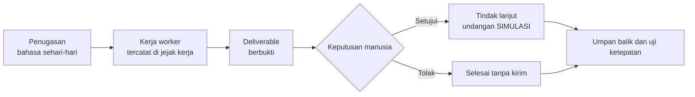
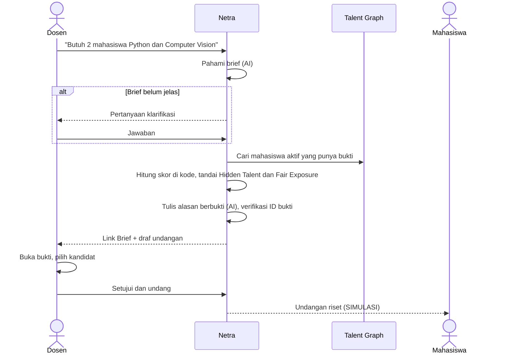
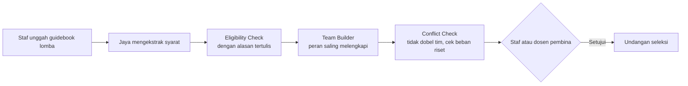
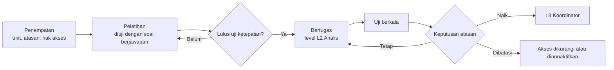

# TalentLink Campus: model bisnis dan alur kerja

Dokumen ini menjelaskan siapa yang memakai TalentLink Campus, apa nilai bisnisnya bagi kampus dan bagi CBN, dan bagaimana alur kerjanya untuk setiap pengguna. Dipakai untuk pitch, slide, dan penyelarasan tim.

## 1. Satu kalimat

TalentLink Campus adalah tim **Digital Worker** di platform CBN yang ditempatkan di unit-unit kampus untuk mencarikan mahasiswa yang tepat bagi riset dosen dan tim lomba. Setiap rekomendasinya menunjuk bukti, dan setiap tindakannya menunggu persetujuan manusia.

## 2. Masalah bisnis yang diselesaikan

Kampus sudah punya data kemampuan mahasiswa (nilai, proyek, sertifikat, prestasi, pengalaman asisten), tetapi datanya tersebar dan tidak dipakai untuk mengambil keputusan. Akibatnya:

| Masalah | Akibat bagi kampus |
| --- | --- |
| Dosen mencari anggota riset dari ingatan dan kenalan | Riset lambat dimulai; kandidat terbatas pada mahasiswa yang pernah diajar |
| Staf kemahasiswaan menyaring syarat lomba secara manual | Syarat terlewat; peluang berputar di mahasiswa yang sama |
| Tidak ada yang melihat gambaran utuh talenta kampus | Mahasiswa berpotensi yang belum pernah juara tidak terlihat |

Masalah ini menyentuh indikator yang dipantau pimpinan kampus, misalnya keterlibatan mahasiswa dalam riset dan lomba serta kesiapan kerja lulusan. Contohnya Indikator Kinerja Utama (IKU) perguruan tinggi. Versi IKU yang berlaku perlu dicek ulang sebelum dipakai di pitch.

## 3. Siapa yang memakai

TalentLink Campus memakai pola organisasi CBN Digital Worker: setiap worker punya **jabatan, penempatan, atasan, tingkat kemampuan, knowledge base, dan hak akses**.

| Peran | Contoh orang | Hubungan dengan sistem | Yang ia dapat |
| --- | --- | --- | --- |
| **Pemberi tugas** | Dosen peneliti | Memberi tugas ke Netra, menyetujui undangan riset | Shortlist berbukti dalam satu menit, termasuk mahasiswa dari kelas lain |
| **Pemberi tugas** | Staf Bagian Kemahasiswaan, dosen pembina lomba | Memberi tugas ke Jaya, menyetujui undangan seleksi | Tim yang lolos syarat dengan peran saling melengkapi |
| **Atasan worker** | Kepala LPPM, Kepala Bagian Kemahasiswaan | Menempatkan worker, mengatur hak akses, membaca hasil uji, memutuskan naik level | Kendali atas apa yang boleh dikerjakan worker dan berapa biayanya |
| **Pimpinan / pembeli** | Wakil Direktur bidang akademik atau kemahasiswaan | Membaca ringkasan lintas unit | Bukti dampak: berapa mahasiswa baru yang mendapat kesempatan, berapa waktu yang dihemat |
| **Pengelola data** | UPT TIK, pengelola SIAKAD | Menyediakan data, mengatur integrasi dan akses | Data dipakai tanpa diubah; akses terbatas dan tercatat |
| **Penerima** | Mahasiswa | Menerima undangan riset atau seleksi lomba | Diundang karena bukti kemampuan, bukan popularitas |
| **Penyedia platform** | CBN | Menyediakan platform Digital Worker, model AI, dan alokasi token | Peran (role) kampus siap pakai di atas platformnya |

## 4. Tim Digital Worker

| | Netra | Jaya |
| --- | --- | --- |
| Jabatan | Research Talent Officer | Competition Team Officer |
| Penempatan | LPPM | Bagian Kemahasiswaan |
| Atasan | Kepala LPPM | Kepala Bagian Kemahasiswaan |
| Pemberi tugas | Dosen peneliti | Staf kemahasiswaan, dosen pembina |
| Knowledge base | Talent Graph kampus, katalog skill | Guidebook lomba, Talent Graph |
| Deliverable | Link Brief riset | Usulan tim lomba |
| Butuh persetujuan | Kirim undangan riset | Kirim undangan seleksi |
| Status di MVP | **Bertugas** (didemokan penuh) | Dalam pelatihan |

Keduanya membaca **satu Talent Graph** dan memakai **satu alokasi token**. Inilah kekuatan utamanya: satu sumber talenta untuk dua unit, sehingga tanda Fair Exposure dan cek konflik bisa berlaku lintas unit.

## 5. Alur kerja

### 5.1 Pola yang sama untuk semua worker

Setiap worker mengikuti enam langkah yang sama. Pola ini membuat sistem mudah dipahami dan mudah ditambah worker baru.

| Langkah | Siapa | Prinsip |
| --- | --- | --- |
| 1. Penugasan | Pemberi tugas | Cukup bahasa sehari-hari; worker bertanya balik jika kurang jelas |
| 2. Kerja worker | Digital Worker | Hanya memakai tool yang diizinkan; setiap langkah dan token dicatat |
| 3. Deliverable | Digital Worker | Setiap klaim menunjuk ID bukti yang bisa dibuka |
| 4. Keputusan | Pemberi tugas | Worker tidak pernah mengirim apa pun tanpa persetujuan |
| 5. Tindak lanjut | Sistem | Di prototipe, pengiriman berlabel SIMULASI |
| 6. Uji ketepatan | Atasan worker | Kinerja worker diuji dengan soal berjawaban (skrip eval) sebelum diberi tugas lebih besar |

### 5.2 Research Matching oleh Netra (MVP, didemokan)

Titik nilai bisnis di alur ini:

- **Waktu:** dari "bertanya ke kolega" selama berhari-hari menjadi Link Brief dalam kurang dari satu menit.
- **Kepercayaan:** dosen tidak diminta percaya ke AI; dosen membuka buktinya sendiri.
- **Keadilan:** Hidden Talent memunculkan mahasiswa tanpa prestasi formal; Fair Exposure memberi tanda pada mahasiswa yang sudah terlalu sering dilibatkan.
- **Kendali:** keputusan akhir tetap di tangan dosen.

### 5.3 Competition Matching oleh Jaya (roadmap)

Nilai lintas unit: Conflict Check membaca penugasan Netra, jadi mahasiswa yang baru diundang riset tidak langsung dibebani lomba.

### 5.4 Siklus hidup worker, dikelola atasan

Bagian ini menerapkan konsep siklus hidup CBN Digital Worker.

| Level | Boleh mengerjakan | Syarat |
| --- | --- | --- |
| L1 Asisten | Mencari kandidat | Ditempatkan oleh atasan |
| L2 Analis | Menilai dan menjelaskan dengan bukti; kirim butuh persetujuan | Lulus uji ketepatan (12 soal eval) |
| L3 Koordinator | Menyusun tim lintas unit | Lulus uji ketepatan secara konsisten dan disetujui atasan |

### 5.5 Siapa melakukan apa

R = mengerjakan, A = memutuskan, C = dimintai masukan, I = diberi tahu.

| Kegiatan | Dosen / staf | Digital Worker | Atasan unit | Pimpinan | TI / data | Mahasiswa |
| --- | --- | --- | --- | --- | --- | --- |
| Menulis penugasan | R | | | | | |
| Mencari dan menilai kandidat | | R | | | | |
| Menyetujui undangan | A | | I | | | I |
| Menempatkan worker dan hak akses | | | A | I | R | |
| Menguji worker (skrip eval) | | R | A | I | C | |
| Menyediakan data | | | C | | R | |
| Memantau dampak lintas unit | | | C | A | | |

## 6. Model bisnis

### 6.1 Posisi

TalentLink Campus adalah **paket peran kampus siap pakai** (role template) di atas platform CBN Digital Worker. CBN menyediakan platform, model AI, dan infrastruktur. TalentLink menyediakan peran khusus kampus: alur kerja, knowledge base talenta, rumus skor berbukti, dan aturan tata kelola.

### 6.2 Cara menghasilkan nilai

Semua angka harga di bawah adalah **hipotesis** yang perlu divalidasi dengan kampus dan CBN.

| Komponen | Isi |
| --- | --- |
| Pembeli | Pimpinan kampus; anggaran dari unit (LPPM dan Bagian Kemahasiswaan) |
| Pengguna harian | Dosen dan staf unit |
| Bentuk jual | Langganan per Digital Worker per unit per tahun, seperti merekrut satu staf digital |
| Biaya pemakaian | Alokasi token dari CBN, terlihat per worker di Token Ledger |
| Jalur masuk | Pilot gratis di satu prodi dengan data teranonimkan, lalu perluasan per unit |
| Saluran | Penjualan enterprise CBN ke kampus; tim TalentLink sebagai mitra solusi |

### 6.3 Ukuran keberhasilan bisnis

| Untuk siapa | Ukuran | Cara mengukur |
| --- | --- | --- |
| Dosen | Waktu dari kebutuhan riset sampai anggota terpilih | Selisih waktu penugasan dan persetujuan |
| Dosen | Shortlist yang disetujui tanpa diubah | Tabel persetujuan |
| Unit kemahasiswaan | Mahasiswa unik yang mendapat kesempatan | Kode mahasiswa yang diundang per semester |
| Pimpinan | Hidden Talent yang diundang | Kandidat berbadge Hidden Talent yang disetujui |
| Atasan unit | Biaya AI per penugasan | Token Ledger |
| CBN | Worker aktif dan pemakaian token per kampus | Data platform |

Ukuran teknis (ketepatan, bukti, biaya, kecepatan) diukur skrip eval dan ditulis ke `eval/results.md`. Halaman Rapor di aplikasi ditunda; ukuran bisnis di atas bisa ditambahkan setelah MVP.

### 6.4 Pembeda

| Alternatif | Kekurangannya | TalentLink Campus |
| --- | --- | --- |
| Sistem informasi prestasi | Mencatat prestasi yang sudah terjadi | Mencari kandidat untuk kebutuhan baru |
| Spreadsheet dan grup chat | Manual, tidak adil, tidak tercatat | Otomatis, ada tanda Fair Exposure, setiap langkah tercatat |
| Chatbot AI umum | Bisa mengarang; tidak punya akses data kampus | Skor dihitung di kode, setiap alasan berbukti |
| Digital Worker generik | Belum mengerti konteks kampus | Peran, data, dan aturan khusus kampus |

## 7. Tata kelola dan kepercayaan

- **Persetujuan manusia:** tidak ada pesan yang terkirim tanpa persetujuan. Pengiriman di prototipe berlabel SIMULASI.
- **Akses baca saja:** worker tidak bisa mengubah data akademik.
- **Jejak audit:** setiap penugasan, langkah, panggilan AI, token, dan keputusan tercatat dengan waktu.
- **Privasi dan keadilan:** nama, gender, dan foto tidak dipakai menghitung skor; data mentah tidak dikirim ke AI selain bukti yang relevan.
- **Ketahanan:** instruksi tersembunyi di data mahasiswa diabaikan; peringkat ditentukan kode.
- **Consent (roadmap):** mahasiswa menyetujui untuk dihubungi melalui portal profil.

## 8. Cakupan MVP dibanding produk penuh

| Bagian | MVP hackathon | Produk penuh |
| --- | --- | --- |
| Pengguna aktif | Dosen peneliti dan staf kemahasiswaan, login email + kata sandi dengan akun demo sintetis | SSO kampus, akun dari admin, pembatasan akses per peran |
| Worker | Netra bertugas; Jaya dalam pelatihan | Netra dan Jaya bertugas; Kanca (Career Readiness) sebagai worker ketiga |
| Data | 80 mahasiswa sintetis | Data kampus teranonimkan, integrasi SIAKAD |
| Pengiriman | SIMULASI | Email atau WhatsApp resmi kampus |
| Uji ketepatan | Skrip eval 12 soal, hasil di README | Halaman Rapor berkala dan ukuran bisnis |
| Atasan unit | Belum ada layar khusus | Layar penempatan, hak akses, dan keputusan level |

## 9. Alur cerita untuk pitch

1. **Masalah:** Bu Rina butuh dua mahasiswa Computer Vision, tetapi hanya kenal mahasiswa di kelasnya.
2. **Tim digital:** perkenalkan Netra seperti pegawai baru, lengkap dengan jabatan, atasan, dan hak aksesnya.
3. **Demo:** juri memberi topik riset; Netra menyelesaikan penugasan, termasuk menemukan Hidden Talent.
4. **Kepercayaan:** buka satu bukti; tunjukkan undangan baru terkirim setelah disetujui.
5. **Hasil uji:** tunjukkan tabel eval v1 vs v2 di slide; Netra tepat memilih dan hemat token.
6. **Skala:** satu Talent Graph untuk dua unit; Jaya menyusul, dan Kanca untuk Career Center ada di roadmap.
