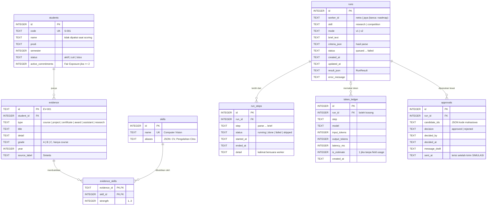

# ERD database TalentLink Campus

Sumber kebenaran: `lib/schema.ts` dan DDL di `lib/db.ts`. Satu file SQLite (`data/talentlink.db`), dibuat otomatis saat pertama dibuka dan diisi lewat `npm run seed`.

## Dua kelompok tabel

| Kelompok | Tabel | Sifat |
| --- | --- | --- |
| Talent Graph | `students`, `skills`, `evidence`, `evidence_skills` | Hanya diisi oleh seed. Worker dan API **read-only** |
| Jejak run | `runs`, `run_steps`, `token_ledger`, `approvals` | Ditulis oleh pipeline dan API; membuat hasil tetap ada setelah refresh |

`evidence_skills` adalah sisi graph: satu bukti bisa membuktikan beberapa skill dengan kekuatan berbeda. Skor kandidat dihitung dari sini (`strength/3 × w_type × w_recency`, ambil yang terbaik per skill).

## Relasi logis tanpa foreign key

- `runs.worker_id` merujuk ke `id` di `lib/workers.json`, bukan tabel.
- `approvals.candidate_ids` dan `runs.result_json` menyimpan kode mahasiswa (`S-101`) dan ID bukti (`EV-012`) sebagai JSON.
- `token_ledger.run_id` boleh kosong agar panggilan LLM di luar run tetap tercatat di budget.

## Indeks

| Indeks | Untuk |
| --- | --- |
| `students(status, semester)` | Filter kandidat aktif dan semester minimum |
| `evidence(student_id)` | Join bukti per mahasiswa |
| `evidence_skills(skill_id, evidence_id)` | Search per skill |
| `run_steps(run_id, id)` | Timeline berurutan |
| `token_ledger(run_id)` | Token per run dan per langkah |
| `approvals(run_id, id)` | Approval terakhir |
| `runs(created_at)` | Daftar 20 run terbaru |
