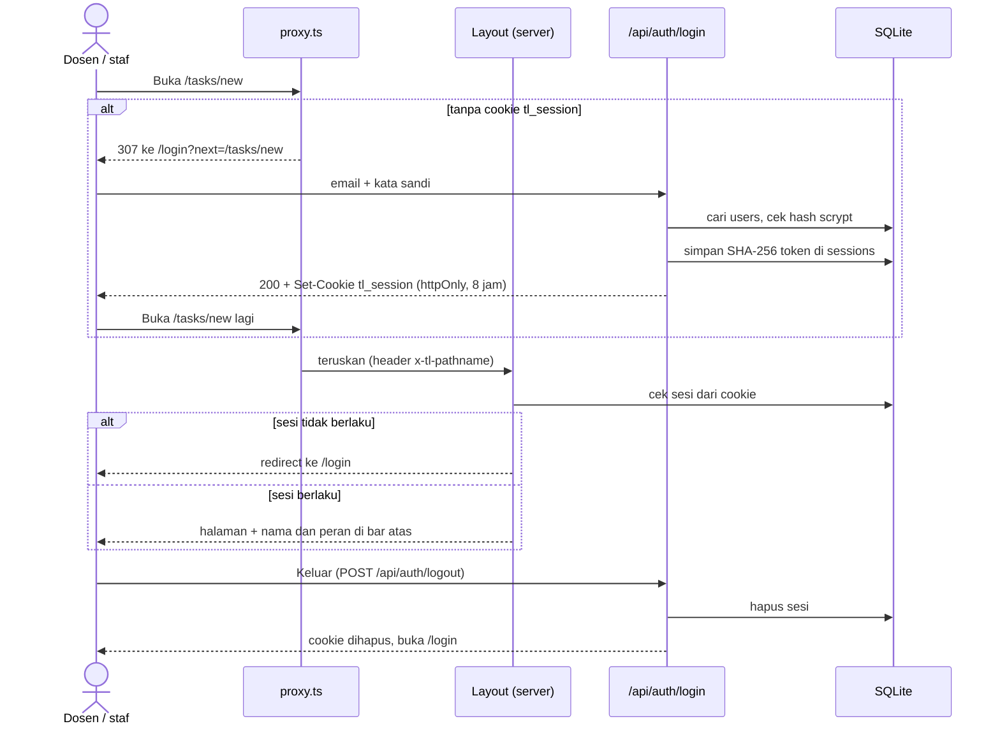

# Fitur login dan logout

Tanggal: 10 Oktober 2026 · Oleh: Rifqi · Branch: `feat/auth-login` (dibuat dari `origin/master` commit `eabe987`)

> **Peringatan untuk Rofiq dan Reyhan.** Fitur ini menyentuh folder backend dan **mengubah ERD** (dua tabel baru). Semua perubahan bersifat aditif: tidak ada kolom lama yang diubah atau dihapus, dan bentuk respons endpoint lama tetap sama. Tetapi setelah branch ini di-merge, **semua endpoint `/api/*` wajib login**. Baca bagian 4 sebelum menguji API dengan `curl` atau menulis Route Handler baru.

## 1. Keputusan

| Keputusan | Alasan |
| --- | --- |
| Login dengan email dan kata sandi saja, tanpa Google atau SSO | Permintaan tim; tanpa layanan luar |
| Sesi di database (`sessions`) dengan token acak di cookie httpOnly | Logout benar-benar mencabut sesi di server; tidak butuh secret di `.env` |
| Hash kata sandi memakai `scrypt` bawaan Node | Tanpa dependensi baru |
| `proxy.ts` hanya memeriksa ada tidaknya cookie | Sesuai panduan Next 16: proxy untuk pengecekan cepat, validasi sesi di server |
| Validasi sesi di root layout dan di `handle()` setiap Route Handler | Satu titik untuk semua API; tidak perlu mengubah tiap route |
| Akun dibuat sistem (akun demo), tanpa pendaftaran mandiri | Cakupan MVP; di produksi akun dibuat admin kampus |
| Belum ada pembatasan akses per peran | Cukup login dulu; pembatasan per peran masuk FR-A8 (Nanti) |

## 2. Alur



## 3. Akun demo

| Email | Nama | Peran | Kata sandi |
| --- | --- | --- | --- |
| `rina@kampus.test` | Bu Rina | Dosen peneliti | `talentlink2026` |
| `andi@kampus.test` | Pak Andi | Staf kemahasiswaan | `talentlink2026` |

- Data sintetis. Domain `.test` dicadangkan untuk pengujian, jadi tidak mengarah ke alamat email sungguhan.
- Akun dibuat otomatis saat login pertama (`ensureDemoUsers()` di `lib/auth.ts`). Tidak perlu langkah seed tambahan.
- `npm run seed` **tidak** menghapus `users` dan `sessions`.
- Halaman login punya dua kartu akun demo yang mengisi form otomatis.

## 4. Dampak ke backend

| Berkas | Perubahan | Risiko conflict |
| --- | --- | --- |
| `lib/db.ts` | DDL tabel `users` dan `sessions` ditambah di akhir string DDL | Rendah; aditif di akhir |
| `lib/schema.ts` | Tabel Drizzle `users` dan `sessions` ditambah di akhir berkas | Rendah; aditif |
| `lib/http.ts` | `handle(fn)` sekarang memeriksa sesi dulu (401 jika tidak ada) dan memberi `user` ke `fn`. Ada `handlePublic()` untuk login dan logout | **Sedang**: jika Rofiq juga mengubah berkas ini, gabungkan manual |
| `app/api/runs/[id]/approve/route.ts` | `decidedBy` diisi `"<nama> (<peran>)"` dari pengguna yang login | Rendah |
| Baru: `lib/auth.ts`, `lib/auth-types.ts`, `lib/session.ts`, `lib/auth.test.ts`, `proxy.ts`, `app/api/auth/{login,logout,me}/route.ts` | Logika login, sesi, dan proteksi | Tidak ada |

Yang **tidak** berubah: pipeline, rumus skor, verifikasi, seed, `lib/service.ts`, bentuk semua respons API lama, dan `lib/api-types.ts`.

**ERD berubah:** `docs/database-erd.md` sudah ditambah `users` dan `sessions`. Tidak perlu migrasi manual karena DDL memakai `CREATE TABLE IF NOT EXISTS`; tabel baru dibuat otomatis saat database dibuka.

**Cara uji API dengan `curl` setelah merge:**

```bash
curl -c cookie.txt -X POST http://localhost:3000/api/auth/login -H 'Content-Type: application/json' \
  -d '{"email":"rina@kampus.test","password":"talentlink2026"}'
curl -b cookie.txt http://localhost:3000/api/runs
```

CLI (`npm run cli`) dan skrip seed tidak terpengaruh karena tidak lewat HTTP.

## 5. Dampak ke frontend

| Berkas | Perubahan |
| --- | --- |
| Baru: `app/login/page.tsx`, `components/app/login-form.tsx` | Halaman login (inspirasi `design/inspiration/05-login-split.jpg`) |
| Baru: `components/app/app-shell.tsx` | Kerangka aplikasi dipindah dari layout; halaman login tampil tanpa kerangka |
| Baru: `components/app/user-menu.tsx` | Nama, peran, dan tombol Keluar di bar atas |
| Baru: `components/ui/input-field.tsx` | Input satu baris dengan label di garis atas dan ikon |
| Baru: `app/_lib/safe-next.ts` | Mencegah open redirect pada parameter `next` |
| `app/layout.tsx` | Membaca sesi di server; tanpa sesi dialihkan ke `/login` |
| `components/app/top-bar.tsx` | Chip "Peran tanpa login (SIMULASI)" diganti `UserMenu` |
| `app/_lib/api.ts` | `authApi` (login, logout, me); 401 otomatis membuka `/login?next=…` |
| `app/globals.css` | Aturan fokus global dipindah ke `@layer base` agar field dengan cincin fokus sendiri tidak bergaris ganda |
| `components/ui/field.tsx` | Cincin fokus pada textarea |

**Mode mock:** login selalu memakai server asli, juga saat `NEXT_PUBLIC_API_MOCK=true`. Database cukup ada (`npm run seed`); akun demo dibuat otomatis.

## 6. Pengujian

| Uji | Hasil |
| --- | --- |
| `npm test` | 83 test lulus (71 lama + 12 baru di `lib/auth.test.ts`) |
| `npx tsc --noEmit`, `npm run lint`, `npm run build` | Lulus |
| `curl` ke server `next start` (database sementara, `LLM_MOCK=true`) | 18 cek lulus: redirect halaman, 401 API, cookie palsu ditolak, pesan login sama untuk email salah dan kata sandi salah, cookie httpOnly, open redirect dicegah, run Netra jalan setelah login, kirim tanpa persetujuan tetap 403, `decidedBy` atas nama pengguna, token lama ditolak setelah logout |
| Playwright di browser | 15 cek lulus: alur login, validasi, fokus setelah gagal, akun demo, kembali ke halaman tujuan, logout, tampilan mobile tanpa scroll horizontal |

Belum diuji: API CBN asli (`.env` belum ada di laptop frontend).

## 7. Belum dikerjakan (roadmap)

- Pembatasan percobaan login per email (rate limit).
- Pembatasan akses per peran (FR-A8).
- Lupa kata sandi, ganti kata sandi, dan halaman manajemen akun.
- SSO kampus.
- Menghapus akun demo dan kartu akun demo di halaman login untuk versi produksi.
