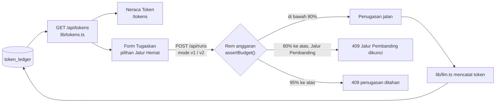

# Fitur Neraca Token dan Jalur Hemat

Tanggal: 10 Oktober 2026 · Oleh: Rifqi · Branch: `feat/token-management` (dibuat dari `master` commit `eb9f62d`)

> **Peringatan untuk Rofiq dan Reyhan.** Fitur ini menyentuh folder backend (`lib/service.ts`, `lib/llm.ts`, `lib/api-types.ts`), tetapi **ERD tidak berubah**: tidak ada tabel, kolom, atau indeks baru. Yang berubah adalah perilaku dua endpoint lama: `POST /api/runs` dan `POST /api/runs/:id/retry` sekarang bisa membalas **409** saat anggaran token menipis atau habis. Baca bagian 3 dan 5 sebelum mengubah `createRunFromBody` atau `retryRun`.

## 1. Nama fitur

| Nama | Isi | Alasan nama |
| --- | --- | --- |
| **Neraca Token** | Halaman `/tokens` (menu "Neraca Token"): anggaran terpakai dan sisa, status anggaran, penghematan, dan rincian pemakaian | Dalam konsep CBN, Digital Worker adalah pegawai yang punya biaya operasional (token). "Neraca" adalah istilah yang sudah dikenal unit kampus untuk catatan anggaran: berapa yang dipakai dan berapa sisanya |
| **Jalur Hemat** | Pilihan jalur kerja saat menugaskan Netra: **Jalur Hemat** (v2, bawaan) atau **Jalur Pembanding** (v1) | Istilah "jalur hemat" sudah dipakai di kode backend (`lib/worker/run.ts`: "Jaya selalu memakai jalur hemat (v2)"). Menggantikan centang "mode pembanding" yang sebelumnya disederhanakan |

Kode, API, dan database tetap memakai `mode: "v1" | "v2"`. Nama Jalur Hemat dan Jalur Pembanding hanya untuk tampilan.

## 2. Cara keduanya terhubung



1. **Perkiraan di form berasal dari Neraca.** Kartu Jalur Hemat dan Jalur Pembanding menampilkan rata-rata token per penugasan dari Token Ledger. Jika belum ada data, dipakai perkiraan PRD (6.500 dan 30.000 token).
2. **Kunci yang sama di dua tempat.** Form dan Neraca sama-sama membaca `comparisonLocked` dan `usage.stop`. Server menegakkan aturan yang sama lagi, jadi permintaan langsung ke API tetap ditolak.
3. **Hasil langsung terlihat.** Setiap penugasan tercatat di Token Ledger dan langsung muncul di batang per penugasan serta angka penghematan di Neraca.

## 3. Aturan anggaran (rem anggaran)

| Status | Batas bawaan | Yang terjadi |
| --- | --- | --- |
| Aman | di bawah 80% (8.000.000 token) | Jalur Hemat dan Jalur Pembanding bisa dipilih |
| Menipis | 80% ke atas | Banner kuning di Beranda dan Neraca. Jalur Pembanding dikunci di form. Server membalas 409 untuk Netra dengan `mode: "v1"` di `POST /api/runs` dan untuk coba lagi penugasan v1. Jalur Hemat dan Jaya tetap jalan |
| Berhenti | 95% ke atas (9.500.000 token) | Tombol Tugaskan nonaktif. Server membalas 409 untuk semua penugasan baru dan semua coba lagi. `lib/llm.ts` juga tetap menolak panggilan (perilaku lama) |

- Batas diambil dari `.env` yang sudah ada: `TOKEN_BUDGET_TOTAL`, `TOKEN_BUDGET_WARN`, `TOKEN_BUDGET_STOP`.
- Jawaban klarifikasi tidak dicegat. Jika pemakaian sudah 95% ke atas, panggilan parse ditolak `lib/llm.ts` dan penugasan gagal dengan pesan anggaran.
- Pesan 409:
  - `Anggaran token sudah melewati batas peringatan, jadi Jalur Pembanding dikunci. Pilih Jalur Hemat.`
  - `Anggaran token sudah mencapai batas berhenti. Penugasan baru ditahan sampai alokasi token ditambah.`

## 4. Isi halaman Neraca Token

- **Anggaran token** (satu-satunya kartu mencolok): token terpakai dari alokasi, meteran dengan garis 80% dan 95%, sisa sebelum batas berhenti, perkiraan jumlah penugasan per jalur, jumlah panggilan AI dan berapa yang berupa perkiraan.
- **Penghematan Jalur Hemat:** rata-rata token per penugasan per jalur, persen lebih hemat, token yang sudah dihemat, dan status Jalur Pembanding (terbuka atau dikunci).
- **Rincian pemakaian:** batang token untuk 20 penugasan terakhir (warna per jalur, klik ke jejak kerja), pembagian per Digital Worker, per langkah yang memanggil AI, dan token yang tidak lagi terhubung ke penugasan.
- Aturan anggaran (bagian 3) **tidak punya bagian sendiri** di halaman. Pengguna melihat batasnya dari garis 80% dan 95% di meteran, banner Menipis atau Berhenti, dan status Jalur Pembanding di kartu Penghematan.
- Kartu **Token per penugasan** setinggi kolom Per Digital Worker dan Per langkah kerja; grafiknya ikut memanjang (minimal 12rem) supaya tidak ada ruang kosong.
- Tidak ada kartu simulasi anggaran. Status Menipis dan Berhenti hanya muncul dari pemakaian sungguhan.

**Cara hitung:**

- Rata-rata per jalur hanya memakai penugasan **Netra** yang sudah menghasilkan Link Brief (menunggu persetujuan, disetujui, atau ditolak) dan bertoken lebih dari 0.
  - Jaya tidak ikut, karena selalu Jalur Hemat dan brief-nya guidebook panjang.
  - Penugasan bertoken 0 (`LLM_MOCK=true`) dilewati supaya rata-rata tidak turun.
- Persen lebih hemat = 1 − (rata-rata Jalur Hemat ÷ rata-rata Jalur Pembanding).
- Token dihemat = jumlah penugasan Jalur Hemat × selisih rata-rata kedua jalur.
- Sisa = batas berhenti − token terpakai, minimal 0.
- Perkiraan jumlah penugasan = sisa ÷ rata-rata jalur (atau perkiraan PRD jika belum ada data).

## 5. Dampak ke backend

| Berkas | Perubahan | Risiko conflict |
| --- | --- | --- |
| Baru: `lib/tokens.ts` | `getTokenReport()` dan `computeSavings()`. Hanya membaca `token_ledger` dan `runs` | Tidak ada |
| Baru: `lib/tokens.test.ts` | 12 test: laporan, penghematan, rem anggaran, retry | Tidak ada |
| Baru: `app/api/tokens/route.ts` | `GET`, wajib login lewat `handle()` | Tidak ada |
| `lib/api-types.ts` | `TokenReport`, `TokenModeStats`, `TokenStepStats` ditambah di akhir berkas | Rendah; aditif |
| `lib/llm.ts` | `budgetConfig()` diekspor (tambah `export` dan komentar) | Rendah |
| `lib/service.ts` | `MSG.budgetStop`, `MSG.comparisonLocked`, fungsi `assertBudget()`; dipanggil di `createRunFromBody` (setelah validasi) dan `retryRun`. `retryRun` kini memeriksa status gagal sebelum anggaran | **Sedang**: jika Rofiq juga mengubah dua fungsi itu, gabungkan manual |

**Tidak berubah:** pipeline, rumus skor, verifikasi, seed, pencatatan token di `callLLM`, bentuk semua respons lama.

**ERD tidak berubah.** Neraca hanya membaca `token_ledger` (JOIN `runs`). Query `GROUP BY` pada tabel kecil tidak butuh indeks baru.

```bash
curl -b cookie.txt http://localhost:3000/api/tokens
```

## 6. Dampak ke frontend

| Berkas | Perubahan |
| --- | --- |
| Baru: `app/tokens/page.tsx`, `components/app/neraca-token-view.tsx`, `components/app/neraca-token.tsx` | Halaman Neraca Token |
| Baru: `components/app/path-picker.tsx` | `PathPicker` (pilihan Jalur Hemat untuk Netra) dan `FixedPath` (Jaya) |
| Baru: `app/_lib/token-path.ts` | Teks jalur, perkiraan token, status anggaran, label langkah |
| `components/app/task-form.tsx` | Centang "mode pembanding" diganti `PathPicker`; tombol nonaktif saat anggaran berhenti |
| `components/app/nav.tsx` | Menu "Neraca Token" |
| `app/page.tsx`, `components/app/worker-badge.tsx` | Tautan ke Neraca Token; banner Beranda menyebut kunci Jalur Pembanding |
| `components/app/run-list.tsx`, `app/runs/[id]/page.tsx`, `components/app/link-brief.tsx` | Label "Mode pembanding" diganti "Jalur Pembanding"; detail penugasan selalu menampilkan jalurnya |
| `app/_lib/api.ts`, `app/_lib/types.ts`, `app/_lib/mock-store.ts`, `app/_lib/worker-copy.ts` | `api.getTokenReport()`, tipe dari kontrak, laporan dan rem anggaran versi mock, alasan jalur tetap Jaya |

## 7. Cara mencoba

- **Mode mock** (`NEXT_PUBLIC_API_MOCK=true`): Neraca Token dan pilihan Jalur Hemat tampil dengan data penugasan contoh. Pemakaiannya jauh di bawah 80%, jadi status selalu Aman.
- **Backend asli:** dengan `LLM_MOCK=true` setiap panggilan tercatat 0 token, jadi rem anggaran tidak pernah aktif. Untuk mencobanya, pakai API asli dengan anggaran kecil, misalnya `$env:TOKEN_BUDGET_TOTAL="20000"; npm run dev` di PowerShell. Satu penugasan Jalur Hemat sekitar 6.000 token. Kembalikan nilainya setelah selesai.

## 8. Pengujian

| Uji | Hasil |
| --- | --- |
| `npm test` | 95 test lulus (83 lama + 12 baru di `lib/tokens.test.ts`) |
| `npx tsc --noEmit`, `npm run lint`, `npm run build` | Lulus |
| `curl` ke `next start` (database sementara, `TOKEN_BUDGET_TOTAL=50000`, `LLM_MOCK=true`) | 401 tanpa login; angka laporan benar; Jalur Pembanding 201 di bawah 80% dan 409 saat menipis; Jalur Hemat dan Jaya tetap 201; semua 409 saat berhenti; `/tokens` tanpa login dialihkan ke login |
| Playwright mode mock | 19 cek lulus: halaman tanpa bagian Aturan anggaran dan tanpa kartu simulasi, kartu Token per penugasan setinggi kolom kanan, pilihan jalur lewat keyboard, penugasan Jalur Pembanding, Jaya tanpa pilihan, tanpa scroll horizontal di 390 dan 768 px |
| Playwright backend asli (`TOKEN_BUDGET_TOTAL=60000`, token ditambah bertahap ke database sementara) | 17 cek lulus di tiga fase: Aman (Jalur Pembanding terbuka), Menipis (Jalur Pembanding dikunci, Tugaskan tetap aktif, banner kuning), Berhenti (tombol nonaktif, banner merah) |

Uji ini memakai database sementara di luar repo. `data/talentlink.db` tidak disentuh.

## 9. Belum dikerjakan (roadmap)

- Anggaran per unit atau per worker (LPPM dan Bagian Kemahasiswaan) dan alokasi ulang oleh atasan.
- Riwayat pemakaian harian dan ekspor CSV untuk laporan unit.
- Perkiraan token sebelum menugaskan berdasarkan panjang brief.
- Notifikasi ke atasan saat pemakaian melewati 80%.
- Pembatasan akses halaman Neraca per peran (FR-A8).
- Pencocokan dengan dashboard pemakaian resmi CBN.
